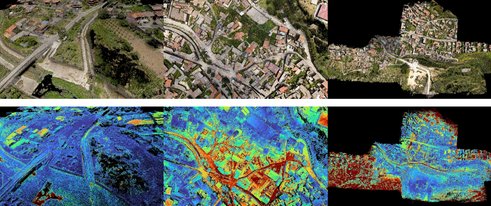

# About

TODO: change abstract

>iVS3D is a framework for intelligent pre-processing of image sequences. iVS3D is able to down sample entire videos to a specific frame rate, as well as to resize and crop the individual images. Furthermore, thanks to the modular architecture, it is easy to develop and integrate plugins with additional algorithms. We provide three plugins as baseline methods that enable an intelligent selection of suitable images and can enrichthem with additional information. To filter out images affected by motion blur, we developed a plugin that detects these frames and also searches the spatial neighbourhood for suitable images as replacements. The second plugin uses optical flow to detect redundant imagescaused by a temporarily stationary camera. In our experiments, we show how this approach leads to a more balanced image sampling if the camera speed varies, and that excluding such redundant images leads to a time saving of 8.1 % for our sequences.

TODO: change LINK

[Link to paper] submitted for the 16th International Symposium on Visual Computing (ISVC 2021).

If you use this project for your research, please cite:

TODO: change bibtex

    @inproceedings{schoenberger2016sfm,
        author={Sch\"{o}nberger, Johannes Lutz and Frahm, Jan-Michael},
        title={Structure-from-Motion Revisited},
        booktitle={Conference on Computer Vision and Pattern Recognition (CVPR)},
        year={2016},
    }

Link to the dataset: https://github.com/3DOM-FBK/usegeo

# Scripts
For the evaluation we provide three main scripts. ***eval_depth_maps.py***  compares one or multiple depth maps with the corresponding ground truth and can also adjust them by median scaling if the estimate has no metric scale. The second script ***eval_pointcloud.py*** evaluates point clouds by calculating the point-to-point distance between corresponding points in the estimation and ground truth. In addition, ICP can be used to refine the alignment once the point clouds have already been roughly aligned. Alternatively, the path to a transformation matrix can be specified. The third script ***eval_mesh.py***, which evaluates triangle meshes, behaves similarly. Here, however, the distance of a ground truth point to a triangle of the mesh is used as a metric. A way to color code the absolute error for visualization is available for both point clouds and triangle meshes. In addition, two utility scripts are available. ***convert_range_maps_to_depth_maps.py*** converts the ground truth published as range maps to conventional depth maps. ***filter_ground_truth_pointcloud.py*** represents our approach to adjust the ground truth by removing LIDAR points that are not visible in the images. 

In addition, the repository contains the configurations of the Self Supervised Depth Esimation (SSDE) approach. For the training, we divided the flights into coherent sequences. The sequences are broken down in the files ***SSDE_image_sequences_data_set_X.txt***. The images excluded from training and testing are located in the file ***SSDE_excluded_images.txt***. Our modeles are trained on the subsets A and B, and evaluated on the subset C.

To install all dependencies: 

    pip install -r requirements.txt

# Evaluation
The evaluation of the methods is divided into the evaluation of depth maps, point clouds and triangle meshes. For the evaluation of point clouds and meshes, the ground truth point cloud is used directly, whereas the ground truth depth maps are obtained by projecting the point clouds into the images. 
## Depth maps
To evaluate the depth maps, the supplied ground truth is used, which was generated by projecting the points of the LiDAR point cloud into the image plane. However, since the ground truth is in the form of range maps, we first transform these into depth maps.

### Online approaches:

0 m  10+ m

|Dataset-1|↓L1-abs|↑Acc0.5|↑Cpl0.5|↑Acc0.1|↑Cpl0.1|↑Acc0.05|↑Cpl0.05|
|---|---|---|---|---|---|---|---|
|FaSS-MVSGPP|0.7486|0.7620|0.5965|0.3612|0.2819|0.1943|0.1517|
|PSLSplitOcc.  |4.5773|0.6291|0.6291|0.3042|0.3042|0.1663|0.1663|
|PSLSplitOcc. GPP |0.4884|0.8458|0.4659|0.4187|0.2291|0.2299|0.1257|
|PSLBestKOcc. |2.3804|0.7611|<ins>0.7611</ins>|0.3735|<ins>0.3735</ins>|0.2009|<ins>0.2009</ins>|
|PSLBestKOcc. GPP|<ins>0.3217</ins>|<ins>0.8894</ins>|0.5885|<ins>0.4565</ins>|0.3014|<ins>0.2468</ins>|0.1630|
|SSDEResNet18|4.9545|0.1233|0.1233|0.0248|0.0248|0.0124|0.0124|
|SSDEResNet50|2.8260|0.1332|0.1332|0.0269|0.0269|0.0134|0.0134|
|SSDEPackNet01|2.7866|0.1362|0.1362|0.0275|0.0275|0.0138|0.0138|

Dataset-2

|Dataset-2|↓L1-abs|↑Acc0.5|↑Cpl0.5|↑Acc0.1|↑Cpl0.1|↑Acc0.05|↑Cpl0.05|
|---|---|---|---|---|---|---|---|
|FaSS-MVSGPP|0.7681|0.6549|0.5110|0.2455|0.1912|0.1310|0.1021|
|PSLSplitOcc. |5.2157|0.5842|0.5842|0.2592|0.2592|0.1395|0.1395|
|PSLSplitOcc. GPP|0.5870|0.7925|0.4238|0.3562|0.1891|0.1920|0.1018|
|PSLBestKOcc.|2.9696|0.7103|<ins>0.7103</ins>|0.3178|<ins>0.3178</ins>|0.1686|<ins>0.1686</ins>|
|PSLBestKOcc. GPP|<ins>0.3949</ins>|<ins>0.8437</ins>|0.5395|<ins>0.3896</ins>|0.2478|<ins>0.2074</ins>|0.1318|

Dataset-3

|Dataset-3|↓L1-abs|↑Acc0.5|↑Cpl0.5|↑Acc0.1|↑Cpl0.1|↑Acc0.05|↑Cpl0.05|
|---|---|---|---|---|---|---|---|
|FaSS-MVSGPP|0.7624|0.6474|0.5163|0.2330|0.1855|0.1217|0.0969|
|PSLSplitOcc.  |5.3428|0.5963|0.5963|0.2425|0.2425|0.1288|0.1288|
|PSLSplitOcc. GPP |0.5795|0.7723|0.4424|0.3183|0.1826|0.1695|0.0973|
|PSLBestKOcc. |3.1116|0.7029|<ins>0.7029</ins>|0.2904|<ins>0.2904</ins>|0.1529|<ins>0.1529</ins>|
|PSLBestKOcc. GPP|<ins>0.4137</ins>|<ins>0.8227</ins>|0.5409|<ins>0.3516</ins>|0.2309|<ins>0.1859</ins>|0.1220|

### Offline approaches:

0 m  10+ m

|Dataset-1|↓L1-abs|↑Acc0.5|↑Cpl0.5|↑Acc0.1|↑Cpl0.1|↑Acc0.05|↑Cpl0.05|
|---|---|---|---|---|---|---|---|
|COLMAPSFM+MVS|0.3724|0.8807|0.8430|0.4720|0.4533|0.2653|0.2550|
|COLMAPMVS|0.3500|0.8890|0.8526|0.5395|0.5183|0.3212|0.3086|
|COLMAPMVS+8K|<ins>0.2765</ins>|<ins>0.9181</ins>|0.8254|<ins>0.6476</ins>|<ins>0.5837</ins>|<ins>0.4258</ins>|<ins>0.3842</ins>|
|OpenMVS|0.3507|0.8689|0.8205|0.4419|0.4186|0.2347|0.2227|
|ACMMP|0.7408|0.8718|<ins>0.8692</ins>|0.5695|0.5680|0.3617|0.3608|

Dataset-2

|Dataset-2|↓L1-abs|↑Acc0.5|↑Cpl0.5|↑Acc0.1|↑Cpl0.1|↑Acc0.05|↑Cpl0.05|
|---|---|---|---|---|---|---|---|
|COLMAPSFM+MVS|0.4397|0.8514|0.8193|0.4454|0.4298|0.2464|0.2379|
|COLMAPMVS|0.4238|0.8581|0.8240|0.4771|0.4588|0.2808|0.2702|
|COLMAPMVS+8K|<ins>0.0044</ins>|<ins>0.9950</ins>|<ins>0.9537</ins>|<ins>0.9832</ins>|<ins>0.9424</ins>|<ins>0.9255|<ins>0.8873</ins>|
|OpenMVS|0.4482|0.8221|0.7751|0.3321|0.3136|0.1672|0.1578|
|ACMMP|0.6360|0.8447|0.8432|0.5197|0.5189|0.3198|0.3194|

Dataset-3

|Dataset-3|↓L1-abs|↑Acc0.5|↑Cpl0.5|↑Acc0.1|↑Cpl0.1|↑Acc0.05|↑Cpl0.05|
|---|---|---|---|---|---|---|---|
|COLMAPSFM+MVS|0.4489|0.8273|0.7969|0.3800|0.3670|0.2045|0.1976|
|COLMAPMVS|0.4307|0.8396|0.8066|0.4173|0.4014|0.2328|0.2240|
|COLMAPMVS+8K|<ins>0.3166</ins>|<ins>0.8925</ins>|0.7721|<ins>0.5688</ins>|<ins>0.4938</ins>|<ins>0.3485</ins>|<ins>0.3023</ins>|
|OpenMVS|0.4413|0.8017|0.7579|0.2867|0.2714|0.1380|0.1306|
|ACMMP|0.6177|0.8271|<ins>0.8252</ins>|0.4510|0.4502|0.2648|0.2644

## Point clouds
Regarding the reconstruction of a dense point cloud, we have only considered offline based methods in this work.

0 m  0.5+ m

|Dataset-1|↓L1-abs in m|↓RMSE in m|↑Cpl.|No. points|
|---|---|---|---|---|
|COLMAPSFM+MVS|0.0778|0.0912|0.5165|13,753,122|
|COLMAPMVS|0.0609|0.0700|0.5911|13,787,242|
|COLMAPMVS+8K|<ins>0.0453</ins>|<ins>0.0510</ins>|<ins>0.6743</ins>|190,358,894|
|OpenMVS|0.0765|0.0898|0.5682|23,014,725|
|ACMMP|0.0473|0.0541|0.6331|53,033,375|

Dataset-2

|Dataset-2|↓L1-abs in m|↓RMSE in m|↑Cpl.|No. points|
|---|---|---|---|---|
|COLMAPSFM+MVS|0.1599|0.1983|0.3339|20,215,643|
|COLMAPMVS|0.0690|0.0812|0.5965|20,332,931|
|COLMAPMVS+8K|<ins>0.0445</ins>|<ins>0.0492</ins>|<ins>0.7041</ins>|271,763,480|
|OpenMVS|0.0976|0.1159|0.5469|34,001,002|
|ACMMP|0.0491|0.0569|0.6436|75,096,267|

Dataset-3

|Dataset-3|↓L1-abs in m|↓RMSE in m|↑Cpl.|No. points|
|---|---|---|---|---|
|COLMAPSFM+MVS|0.1294|0.1611|0.3897|17,087,339|
|COLMAPMVS|0.0782|0.0921|0.5418|17,199,568|
|COLMAPMVS+8K|<ins>0.0514</ins>|<ins>0.0581</ins>|<ins>0.6510</ins>|210,699,535|
|OpenMVS|0.1061|0.1247|0.4865|28,418,405|
|ACMMP|0.0566|0.0664|0.5840|55,845,638|

## Triangle meshes
Since only COLMAP and OpenMVS support the reconstruction of a triangle mesh, the evaluation focuses on these two methods. To investigate the improvement in quality of the OpenMVS refinement step, we evaluate the reconstruction step by itself in addition to the final result.

0 m  0.5+ m

|Dataset-1|↓L1-abs in m|↓RMSE in m|↑Cpl.|No. triangles|
|---|---|---|---|---|
|COLMAPSFM+MVS|0.1011|0.1295|0.5223|59,195,510|
|COLMAPMVS|0.0794|0.1049|0.5976|57,747,344|
|COLMAPMVS+8K|0.0754|0.0980|<ins>0.6607</ins>|109,727,922|
|OpenMVSno refine|0.0816|0.1173|0.5282|7,450,170|
|OpenMVS|<ins>0.0261</ins>|<ins>0.0531</ins>|0.5918|1,467,494|

Dataset-2

|Dataset-2|↓L1-abs in m|↓RMSE in m|↑Cpl.|No. triangles|
|---|---|---|---|---|
|COLMAPSFM+MVS|0.2221|0.2791|0.3239|78,134,162|
|COLMAPMVS|0.0984|0.1336|0.5981|77,404,013|
|COLMAPMVS+8K|0.0868|<ins>0.1172</ins>|<ins>0.6966</ins>|120,631,107|
|OpenMVSno refine|0.1127|0.1558|0.4896|11,637,590|
|OpenMVS|<ins>0.0704</ins>|0.1218|0.5425|2,394,468|

Dataset-3

|Dataset-3|↓L1-abs in m|↓RMSE in m|↑Cpl.|No. triangles|
|---|---|---|---|---|
|COLMAPSFM+MVS|0.2044|0.2571|0.3265|55,706,150|
|COLMAPMVS|0.1144|0.1515|0.5442|65,912,047|
|COLMAPMVS+8K|0.1015|0.1332|<ins>0.6337</ins>|112,077,677|
|OpenMVSno refine|0.1243|0.1687|0.4339|10,329,882|
|OpenMVS|<ins>0.0714</ins>|<ins>0.1219</ins>|0.4850|2,195,850|

## Refined ground truth
Since all areas covered by the camera are also covered by the LiDAR ground truth, it is possible to use the nearest ground truth point for each point or triangle to calculate the accuracy of the point clouds and meshes. For the completeness score, however, we need to assign a correspondence in the estimate to each point in the ground truth point cloud, which is problematic because the LiDAR-scan extends well beyond the area covered by images. For this reason, the results obtained in terms of completeness appear rather low. To get a more realistic value we have additionally filtered the ground truth by removing all points at the edge that are not visible in the images. 

The red area shows the provided lidar point clouds, which
extend beyond the area covered by the images. The blue area represents our adjusted
ground truth.

# License
This code is licensed under the MIT license. Note that this text refers only to the license for the code itself, independent of its thirdparty dependencies, which are separately licensed.

    MIT License

    Copyright (c) 2023 UseGeoEvaluation

    Permission is hereby granted, free of charge, to any person obtaining a copy
    of this software and associated documentation files (the "Software"), to deal
    in the Software without restriction, including without limitation the rights
    to use, copy, modify, merge, publish, distribute, sublicense, and/or sell
    copies of the Software, and to permit persons to whom the Software is
    furnished to do so, subject to the following conditions:

    The above copyright notice and this permission notice shall be included in all
    copies or substantial portions of the Software.

    THE SOFTWARE IS PROVIDED "AS IS", WITHOUT WARRANTY OF ANY KIND, EXPRESS OR
    IMPLIED, INCLUDING BUT NOT LIMITED TO THE WARRANTIES OF MERCHANTABILITY,
    FITNESS FOR A PARTICULAR PURPOSE AND NONINFRINGEMENT. IN NO EVENT SHALL THE
    AUTHORS OR COPYRIGHT HOLDERS BE LIABLE FOR ANY CLAIM, DAMAGES OR OTHER
    LIABILITY, WHETHER IN AN ACTION OF CONTRACT, TORT OR OTHERWISE, ARISING FROM,
    OUT OF OR IN CONNECTION WITH THE SOFTWARE OR THE USE OR OTHER DEALINGS IN THE
    SOFTWARE.

[Link to paper]: <https://arxiv.org/abs/2110.11810>